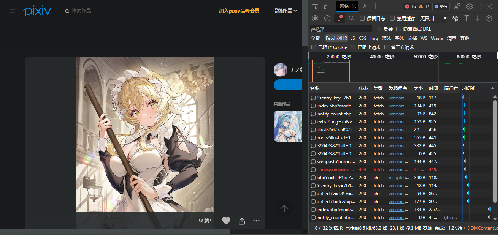
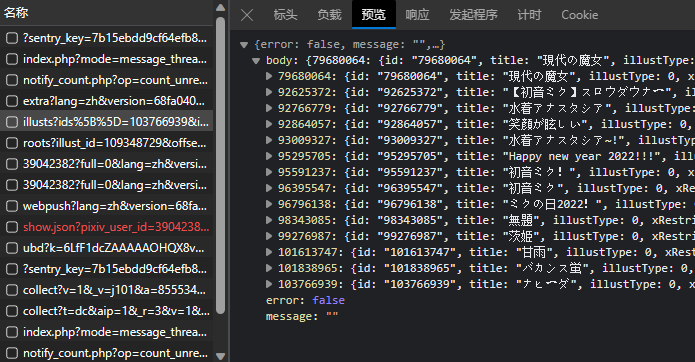
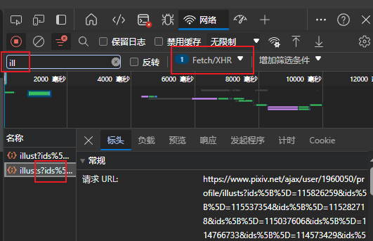

# KTool-Pixiv

用于生成，获取Pixiv作品数据库JSON文件的本家程序!

截至目前（2024.2.9），该程序可以正常运行！如果未来Pixiv修改了ajax数据库格式或者其他的，那么请等待我修改或者自己修改代码√

## 使用方法

很简单，直接下载源代码，首先修改config文件，这里面的`user-agent`和`cookie`请自己访问Pixiv后，填入自己的！！！

随后打开控制台键入`python main.py`即可

首次使用的时候，会自动创建一些文件，比如`/jsons/data.json`，`pids.json`，这些文件必须同时出现，同时移除！

因为`pids.json`是用来检验已经储存在数据库中的文件用的，而`data.json`是数据库，如果你删除了`pids.json`，程序将无法判断哪些是数据库已经有的，哪些是没有的。

## 我需要填入什么内容？

下面是一段获取的数据案例：

```json
[
    {
        "pid": 109489663,
        "p": 2,
        "uid": "17067123",
        "title": "🐐🐐",
        "author": "rock",
        "r18": 0,
        "width": 3095,
        "height": 3728,
        "tags": [
            "女の子",
            "GenshinImpact",
            "少女",
            "甘雨(原神)",
            "OL",
            "착의거유"
        ],
        "url": "https://i.pximg.net/img-original/img/2023/07/01/00/55/44/109489663_p0.jpg",
        "urls": {
            "small": "https://i.pximg.net/c/540x540_70/img-master/img/2023/07/01/00/55/44/109489663_p0_master1200.jpg",
            "regular": "https://i.pximg.net/img-master/img/2023/07/01/00/55/44/109489663_p0_master1200.jpg",
            "original": "https://i.pximg.net/img-original/img/2023/07/01/00/55/44/109489663_p0.jpg"
        }
    }
]
```

使用的时候提供了三种方法，下面我会依次介绍！

### Illust

这个就是在作品页面来获取的，直接打开`开发人员工具`，随后进入一个作品（不是作者，直接点击一个图片就好），可以看到下面这样的：



然后搜索ill，就可以找到如下内容（就是illust开头的一个响应）



复制这个响应的链接，填入即可√

### User

其实差不多啦，老样子，首先打开一个作者的首页，直接滑倒最下面，就可以找到一个`查看更多`的按钮，这个时候先开启网络监听，随后点击按钮：


这个时候一样，搜索ill（可以打开筛选，效率更高），可以找到下面这样的内容！（注意红框，我们需要的是ids！）



然后老样子，直接复制链接，粘贴后就可以使用啦√

### Tag

这个应该是最简单的一个了，直接输入需要的Tag，就可以获取对应的最热门的几张图片√（不要打错字哦，否则估计啥都找不到）

### 合并文件⚠

唔，这个为了稳定性，只允许合并`jsons`目录下的jsons文件，同时输出文件名称只能为`data.json`，为了防止你的数据丢失，请一定要注意自己原来的数据库是否为`data.json`，如果是，并且一开始就是，那么没问题；如果不是，请删除pids文件，并将原来的数据库更名为其他的东西，否则容易出现数据重复或者丢失的情况！